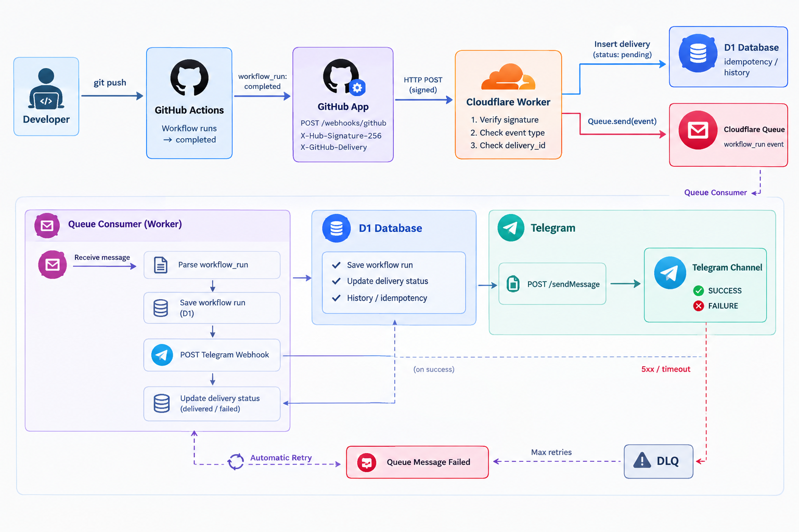

# github-workflow-telegram-notification

A Cloudflare Worker that monitors GitHub Actions workflow runs and sends execution results to
Telegram.



## How it works

```text
GitHub App → Cloudflare Worker → D1 (idempotency + history) → Cloudflare Queue → Telegram
```

A GitHub App webhook fires on `workflow_run` events, the Worker deduplicates and enriches the
payload (failed jobs/steps, commit author, PR requester/merger) via the GitHub REST API, then
formats and sends a message to a Telegram chat.

The Worker itself is written in Go, compiled to WebAssembly with [TinyGo](https://tinygo.org/),
and run on Cloudflare Workers via [`syumai/workers-go`](https://github.com/syumai/workers-go).

For more detail, see:

- [docs/infrastructure/overview-infras.md](docs/infrastructure/overview-infras.md) — full sequence
  diagrams.
- [docs/instruction/github-app-setup.md](docs/instruction/github-app-setup.md) — how to register
  the GitHub App.

## Project layout

| Path | Purpose |
| --- | --- |
| [`main.go`](main.go) | Wires up the HTTP handler and queue consumer. |
| [`internal/github`](internal/github) | Webhook signature verification, payload types, HTTP handler, and a GitHub App REST API client. |
| [`internal/queue`](internal/queue) | The envelope sent through Cloudflare Queues. |
| [`internal/notifier`](internal/notifier) | Queue consumer: enriches, formats, and sends the Telegram message. |
| [`internal/telegram`](internal/telegram) | Telegram Bot API client and message formatting. |
| [`internal/store`](internal/store) | D1 access (delivery idempotency + workflow run history). |
| [`migrations`](migrations) | D1 schema. |

## Getting started

**Requirements:** Go 1.24+, [TinyGo](https://tinygo.org/getting-started/install/) 0.42.0+, Node.js, `npm`.

```sh
npm install                      # also vendors TinyGo into ./.tools via postinstall
cp .dev.vars.example .dev.vars   # fill in secrets for local dev
npm run db:migrations:local
npm run dev                      # wrangler dev
```

## Build & deploy

```sh
npm run build     # go run workers-assets-gen && tinygo build -> ./build/
npm run deploy    # wrangler deploy
```

See [docs/instruction/github-app-setup.md](docs/instruction/github-app-setup.md) for where the GitHub App values come from.

## Contributing

See [CONTRIBUTING.md](CONTRIBUTING.md).
